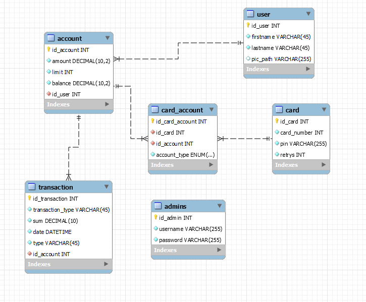

# group_13

# Frontend / Bank-Automat

# Backend RestAPI

## Käytössä olevat Node.JS moduulit:
- dotenv
- mysql2
-nodemon

## HOX HOX!!
Käytössä dotenv moduuli. Luokaa siis backend kansioon oma .env tiedosto ja syöttäkää siihen oman ympäristönne tiedot. Backend kansiossa on .env tiedoston malli. Lisätkää sinne muuttujia jos niitä joudutte omaan ympäristöön luomaan. Siitä on sitte kätevä muiden päivittää omaa .env tiedostoa. **MUISTAJAA POISTAA KAIKKI OMAN YMPÄRISTÖN TIEDOT!!!**

## RestAPI:t
### user
| Tyyppi | Komento                 | Esimerkki | Body Kentät                 | Selite                                                                           |
| ------ | ----------------------- | --------- | --------------------------- | -------------------------------------------------------------------------------- |
| post   | Lisää käyttäjä          | /user/    | firstname,lastname,pic_path | Luodaan käyttäjätietua user tauluun                                              |
| post   | Päivitä käyttäjän tiedot| /user/1   | firstname,lastname,pic_path | Päivitetään käyttäjätietueen tietoja                                             |
| delete | Poista käyttäjä         | /user/1   |                             | Poistetaan käyttäjätietue ID:n perusteella                                       |
| get    | Hae kaikki käyttäjät    | /user/    |                             | Hakee kaikki user taulussa olevat käyttäjätietueet ja palauttaa ne json muodossa |
| get    | Hae tiettyä käyttäjä    | /user/1   |                             | Hakee user taulusta käyttäjätietueen ID:n perusteella                            |

# Database

- MySQL luotuna juuressa olevalla SQL Dumpilla. 